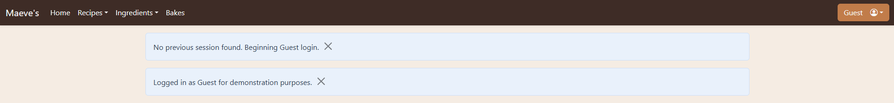
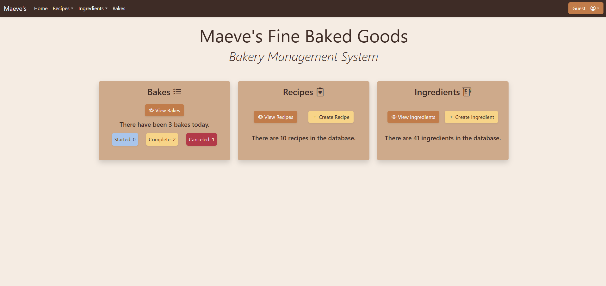
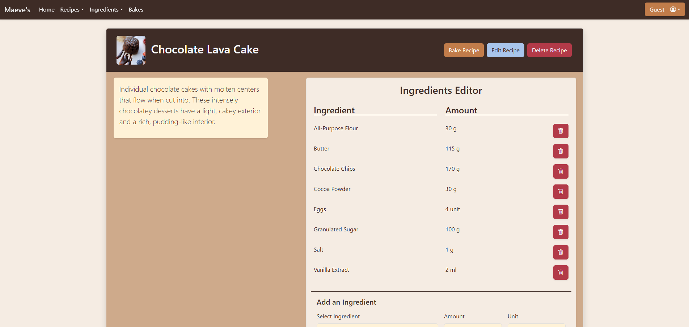
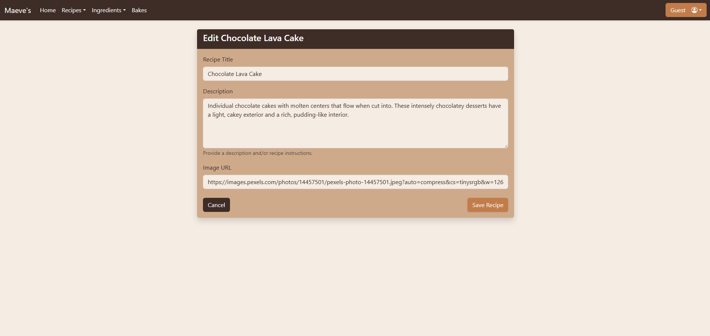
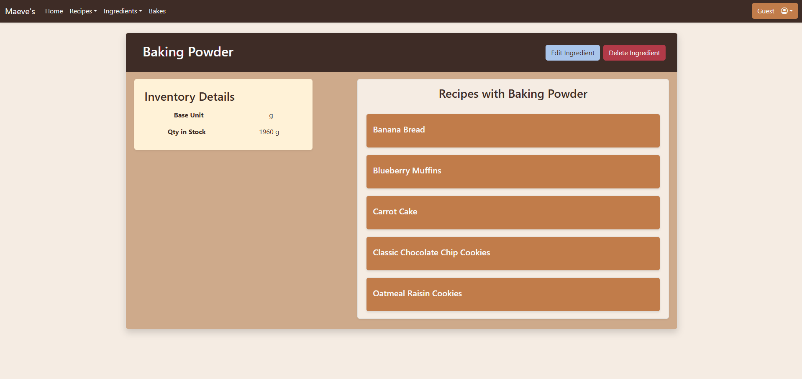
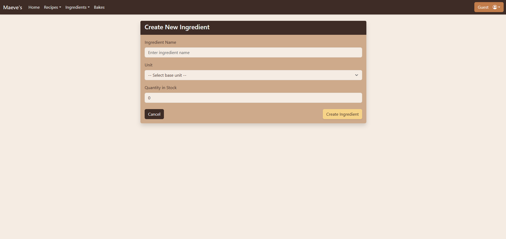

# Bakery Inventory Manager

[Live Application](https://capstone-bakery-frontend.onrender.com)

---

## Summary

Bakery Inventory Manager is a full-stack web application designed to help bakeries (in this case, the fictional "Maeve's Fine Baked Goods") efficiently track ingredients, manage recipes, and monitor daily bakes (real-world instances of recipes in process). Users can log in, view and update ingredient inventory, create and edit recipes, and keep a real-time, detailed record of all bakes made each day. The app will even alert the user if there is not enough ingredient inventory to bake a given recipe before a record is created.

---

## API Documentation

### Bakes ('bakes' table)

- `GET /bakes` — List all bakes.
- `POST /bakes` — Create a new bake record.
- `GET /bakes/:bakeId` — Get info for a specific bake by bake_id.
- `PUT /bakes/:bakeId` — Update bake status ("started", "complete", "canceled").

### Employees ('employees' table)

- `POST /employees` — Register a new employee. Follows by logging in and retrieving user info.
- `POST /employees/login` — Log in and receive a JWT token to store locally for future authentication.
- `GET /employees/me` — Get the current logged-in user's info via local JWT token.

### Ingredients ('ingredients' table)

- `GET /ingredients` — List all ingredients.
- `POST /ingredients` — Create a new ingredient record.
- `GET /ingredients/:ingredientId` — Get a single ingredient record.
- `PUT /ingredients/:IngredientId` — Edit an ingredient record.
- `DELETE /ingredients/:IngredientId` — Delete an ingredient record.
- `PUT /ingredients/bake/:recipeId` — Update ingredient records (quantity_in_stock) to reflect those used by baking a given recipe.

### Recipes ('recipes' and 'recipe_ingredients' tables)

- `GET /recipes` — List all recipes.
- `POST /recipes` — Create a new recipe record.
- `GET /recipes/:recipeId` — Get a single recipe record.
- `PUT /recipes/:recipeId` — Edit a recipe record.
- `DELETE /recipes/:recipeId` — Delete a recipe record.
- `POST /recipes/:recipeId/:ingredientId` — Add an ingredient to a recipe (recipe_ingredients table).
- `DELETE /recipes/:recipeId/:ingredientId` — Delete an ingredient from a recipe (recipe_ingredients table).

### Units ('unit_conversions' table)

- `GET /units` — List all units (eg cup, ml, gal) in the unit_conversions table.
- `GET /units/conversions` — Retrieve the full unit_conversions table for frontend use.

---

## User Views and Screenshots

### Page Toolbar (Top Navigation)


A toolbar stays stuck to the top of the application screen with easy navigation access to various app sections. It also contains the login button, which both displays the current user's name and also allows for user login, logout, and registration. For demonstration purposes, the user is automatically logged in as "Guest". This is because the "bake" functionality of the app requires a valid user_id for proper record keeping.

The user may always log out of the default "Guest" accound and register as a new user/employee, if they wish. Passwords are encrypted using bcrypt, but *please do not use any real-world email addresses and passwords*: these do get recorded in an actual database! I would suggest using something like *Helloworld1!* as a password, if you really want to try the authentication functionality out.

### Alerts Area



Just below the Page Toolbar is an area where user alerts will appear. These provide consistent feedback to users as they navigate and use the app. Alerts can be cleared by clicking the "X" at the end of each.

### Home View



The Home view offers convenient navigation to the primary sections of the app (Bakes, Recipes, and Ingredients), as well as displaying basic statistics concerning each.

### Bakes View


The Bakes View begins with a dashboard displaying the statistics for the day's bakes (real-world instances of recipes in process). Only those bake records which have been created the current calendar day (from 12:00 am local time) will be displayed. The statistics are divided according to the "status" of each given bake record (Started, Complete, Canceled).

Below the dashboard is a set of buttons that toggle different filtering/sorting behavior for the day's bake records. By default, bakes appear in the order they were created. The user can toggle the buttons to sort the records by employee name (ascending) and to filter records based on status.

Finally, the records for all the day's bakes will appear, provided they are not filtered out via the buttons above. Each record displays information regarding the recipe being baked (image and title), as well as the employee who started it, its current status, when it started, and when it was last updated. There are also buttons provided for viewing the associated recipe and updating the bake's status to either "complete" or "canceled".

### Recipes View


The Recipes view displays a list of all recipe records in the database with basic information for each (image and title). Each record also acts as a button which will take the user to see the more information regarding the recipe and associated actions. Finally, the Recipes view provides a button for taking the user to the view for creating a new recipe.

### Recipe View



When a user activates a recipe link, they are taken to the given recipe's view. This view provides all information regarding the recipe: image, title, description, and associated ingredients. *It is worth noting that the area reserved for the recipe "description" is, on larger screens, sized so that a user could also provide recipe instructions in place of or in addition to the description and still be able to view the recipe's ingredients without having to scroll.* The Recipe view also offers buttons to bake, edit, or delete the recipe, as well as an "Ingredients Editor" for adding and removing ingredients.

Lastly, this component is programmed to check required recipe ingredient amounts against the in-stock amounts in the ingredients database. If it calculates that the in-stock amounts are insufficient for baking the recipe, a detailed warning will be displayed and the "Bake Recipe" button disabled until the issue is corrected (by updating the in_stock amount for the affected ingredients in their respective Edit Ingredient views).

### Edit Recipe View



This view allows the user to edit basic information for a given recipe (title, description, and image_url). Existing information is pre-filled into the respective inputs. Recipe ingredients can only be manipulated in the Recipe view.

### Create Recipe View


This view allows the user to create a new recipe with basic information (title, description, and image_url). Recipe ingredients can only be manipulated in the Recipe view.

### Ingredients View


The Ingredients view displays a list of all ingredient records in the database. Each record also acts as a buton which will take the user to see more information regarding the ingredient and associated actions. Finally, the Ingredients view provides a button for taking the user to the view for creating a new ingredient.

### Ingredient View



When a user activates an ingredient link, they are taken to the given ingredient's view. This view provides all information regarding the ingredient: name, base_unit, and quantity_in_stock. The Ingredient view also offers buttons to edit and delete the ingredient. Finally, the view displays a list of all recipes that contain the given ingredient, with each entry acting as a link to the specific recipe's view.

### Edit Ingredient View


This view allows the user to edit basic information for a given ingredient (name, base_unit, and quantity_in_stock). Existing information is pre-filled into the respective inputs.

### Create Ingredient View



This view allows the user to create a new ingredient with basic information (name, base_unit, and quantity_in_stock).

---

## Technologies Used

- React (frontend)
- Node.js & Express (backend)
- PostgreSQL (database)
- Knex.js (query builder)
- Bootstrap (styling)
- jsonwebtoken, bcrypt, jwtDecode (authentication)
- Other backend libraries: CORS, Dotenv, morgan, nodemon

---

## Installation & Running Locally

1. **Clone the repository:**

   ```sh
   git clone https://github.com/JonDManningDev/capstone-bakery-inventory-manager.git
   cd capstone-bakery-inventory-manager
   ```

2. **Install backend dependencies:**

   ```sh
   cd backend
   npm install
   ```

3. **Set up environment variables:**

   - Copy `.env.example` to `.env` and fill in your database credentials, JWT secret, and JWT expiration.

4. **Run database migrations and seeds:**

   ```sh
   npx knex migrate:latest
   npx knex seed:run
   ```

5. **Start the backend server:**

   ```sh
   npm start
   ```

   Or

   ```sh
   npm run dev
   ```

6. **Install frontend dependencies:**

   ```sh
   cd ../frontend
   npm install
   ```

7. **Set up frontend environment variables:**

   - Copy `.env.example` to `.env` and set `REACT_APP_API_BASE_URL` to your backend server URL.

8. **Start the frontend:**

   ```sh
   npm start
   ```

9. **Visit the app in your browser:**
   - Go to [http://localhost:3000](http://localhost:3000)
